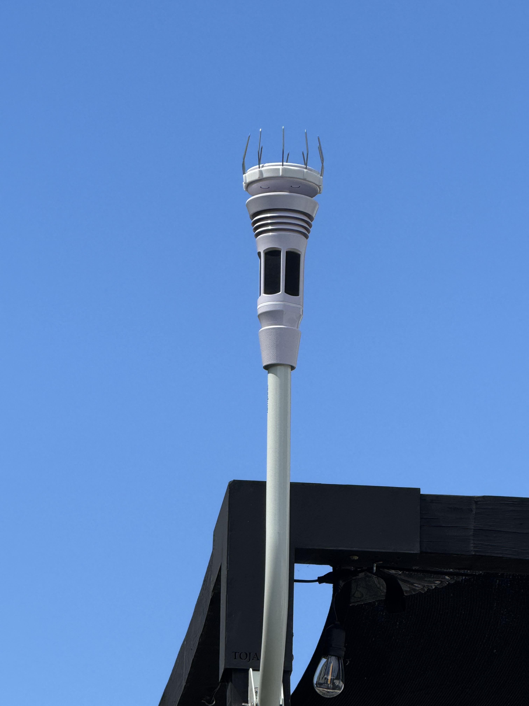
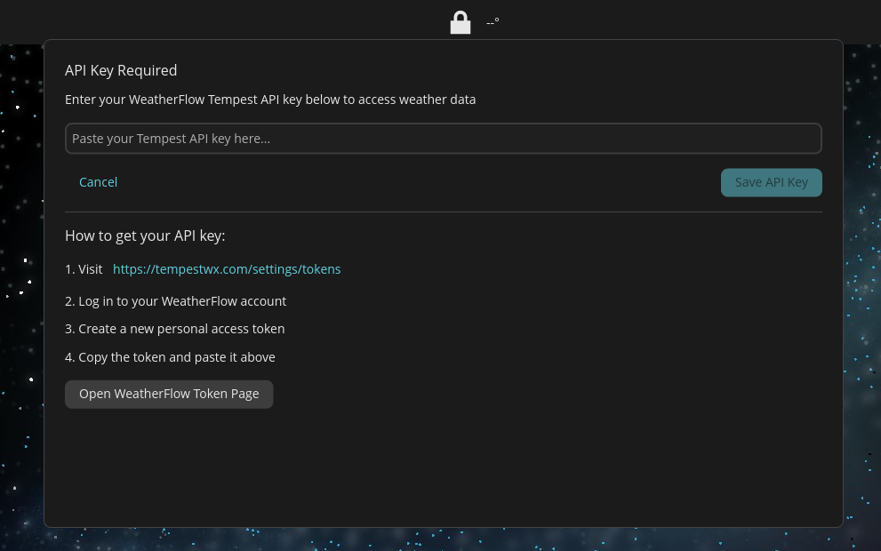
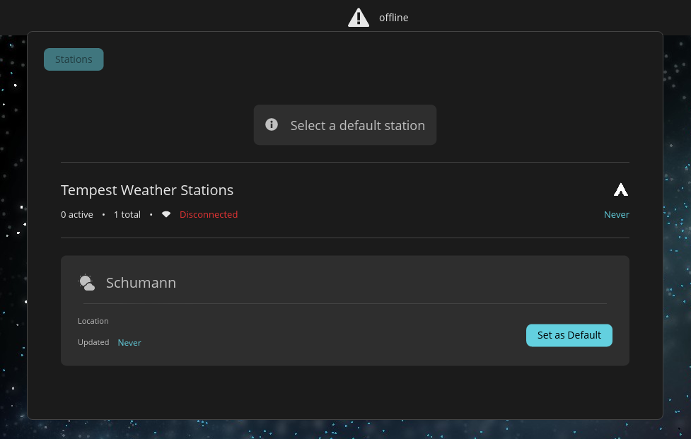
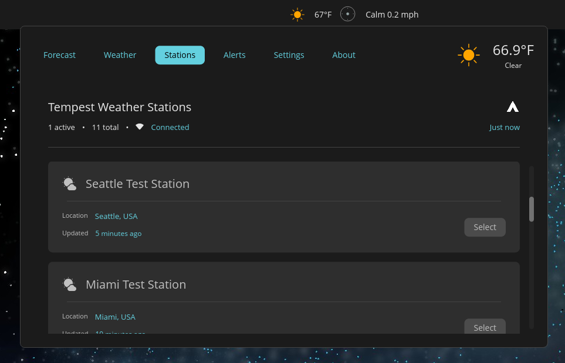
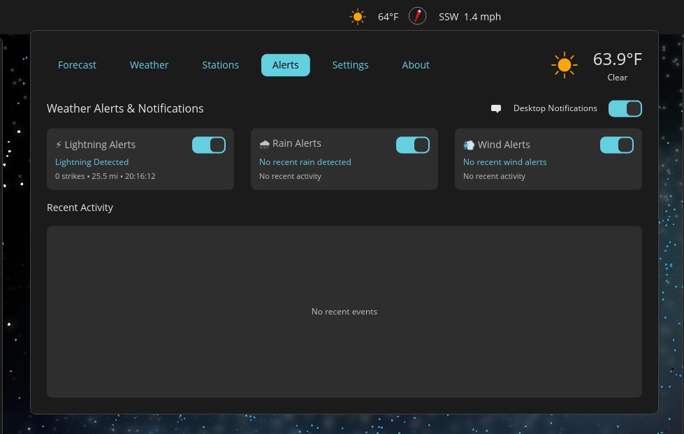
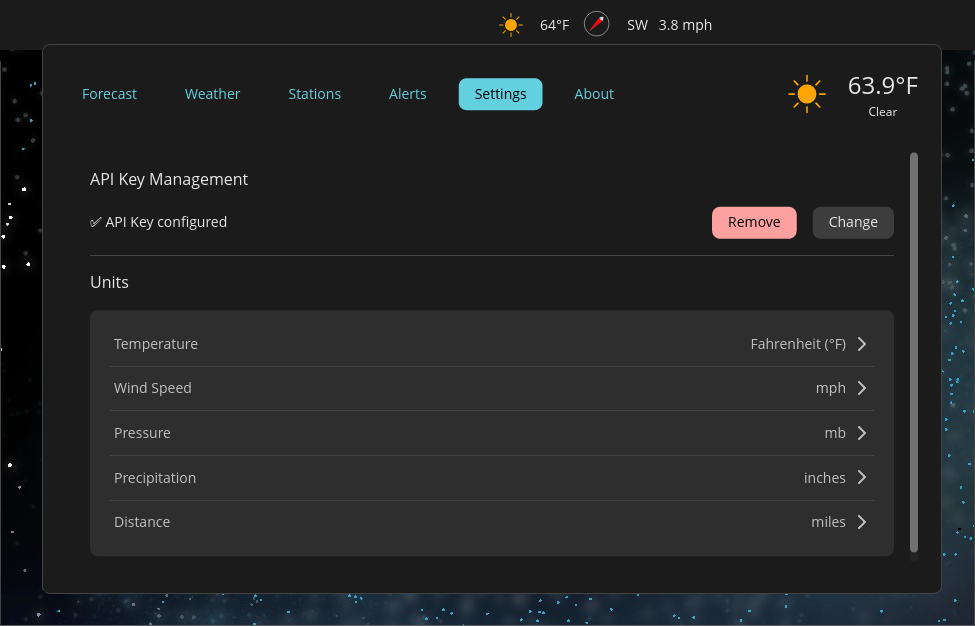
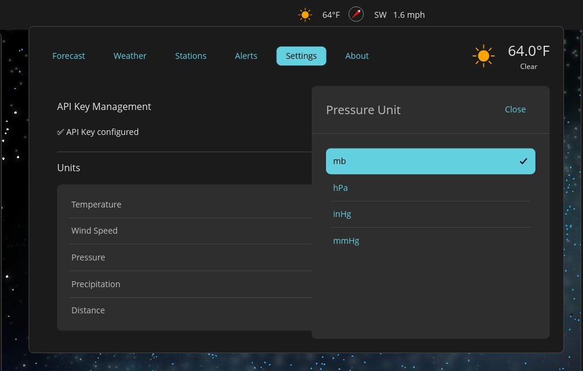
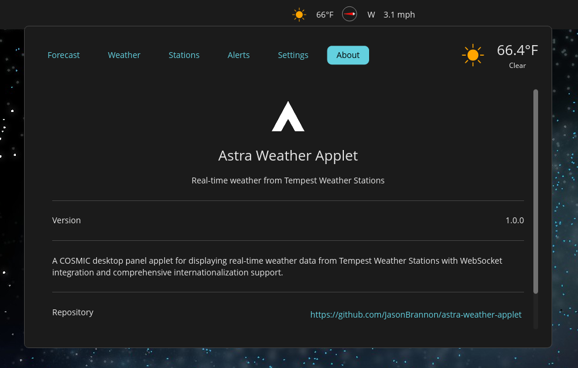
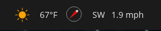

# Features Guide - Developer Reference

**Hardware Required:** [WeatherFlow Tempest](https://weatherflow.com/tempest-weather-system/) + API key from [tempestwx.com/settings/tokens](https://tempestwx.com/settings/tokens)

<p align="center">
  
</p>

## 1. API Key Setup


```rust
// Storage: Secret Service D-Bus API (gnome-keyring, KWallet)
// Fallback: config file (600 permissions) at ~/.config/cosmic/com.slagmine.astra/
// API key values never logged
```

## 2. Station Selection


Multi-station support. Switch anytime → auto cleanup old WebSocket → establish new connection.

## 3. Active Station Monitoring


**Dual connection tracking:**
- REST API: 🟢 Connected, 🟡 Connecting, 🟠 Degraded, 🔴 Failed
- WebSocket: Green (connected) / Gray (disconnected)

Device types: ST (Tempest), HB (Hub), SK (Sky), AR (Air)

## 4. Forecasts


**Hourly:** 7 days, 240 cards, day/night icon variants (6am-8pm/8pm-6am), temperature, conditions, precipitation %, humidity
**Daily:** 10 days, high/low temps, daily conditions, precipitation %
**Performance:** `OnceLock` icon caching for smooth scrolling (240 cards, no frame drops)

## 5. Live Weather


```rust
// Real-time wind updates: WebSocket `rapid_wind` events (2-3s)
// Fallback: `obs_st` events (1 min)
// Data: temp, feels-like, humidity, dew point, pressure + trend, wind (speed/direction),
//       UV index, solar radiation, lightning distance, battery %, last update
// Auto refresh: 5-60 min (configurable, default 15 min)
```

Wind arrow: meteorological convention (direction wind **coming FROM**)

## 6. Desktop Alerts


```rust
// Alert throttling (prevents storm spam):
// Lightning: 60s cooldown, distance (km/mi), energy, panel flash 3s
// Rain: 5min cooldown, start detection
// Wind: 3min cooldown, high-speed events
// First event always notifies → subsequent events throttled
// History: Alerts tab, chronological (newest first)
```

## 7. Settings


- API key management (view status, update, remove)
- Station quick-switch
- Notifications: global + per-event (lightning/rain/wind)
- Refresh intervals: weather (5-60 min, default 15), forecast (60 min)
- Language: auto-detect, 5 languages (en, de, es, gd, ja - 100% synchronized)
- Storage: `~/.config/cosmic/com.slagmine.astra/`

## 8. Unit Preferences


```rust
// src/weather/conversions.rs - 6 unit types, real-time conversion
// Temperature: °C, °F
// Wind: m/s, mph, km/h, knots, Beaufort (0-12), ft/min
// Pressure: mb, hPa, inHg, mmHg
// Precipitation: mm, cm, inches
// Distance: km, miles
// Time: 12h (AM/PM), 24h
```

## 9. About


Version 1.0.0, GPL-3.0-or-later, built with Rust/libcosmic/WeatherFlow API

## 10. Panel Integration


```rust
// Elements: color icon, temp (large), wind arrow (↑↗→↘↓↙←↖), wind speed
// Updates: wind 2-3s (WebSocket), temp 15 min (default), icon on condition change
// Lightning: 3s panel flash
// Resource usage: minimal CPU, lightweight rendering, efficient WebSocket, small memory
// Respects COSMIC density: Compact/Comfortable/Spacious
```

## Developer Features

**DEV_MODE** (`src/constants.rs`): 10 mock stations (Denver, Seattle, Miami, etc.), mock alerts, varied health states

**Performance:** Handler-based (51 handlers, 9 modules), WebSocket auto-reconnect, connection cleanup

**Security:** Secret Service D-Bus API, keyring encryption, no plaintext storage (primary), config fallback (600 perms), no logging

**Code Quality:** Zero warnings, GPL-3.0 headers (all files), SBOM (721 deps)

## Troubleshooting

```bash
# No data: verify API key (Settings), station selected (checkmark), network, REST API green
# WebSocket issues: verify ST/SK device, check indicator, logs: RUST_LOG=debug astra
# Forecast not loading: wait 60 min, check network/API key perms
# API key issues: regenerate (WeatherFlow), verify perms, Secret Service running
```

---

**Links:** [README](README.md) | [Security](SECURITY.md) | [SBOM](SBOM.md) | [WeatherFlow API](https://weatherflow.github.io/Tempest/api/) | [Issues](https://github.com/JasonBrannon/astra-weather-applet/issues)

**Made for the COSMIC Desktop community with ❤️** | GPL-3.0-or-later
