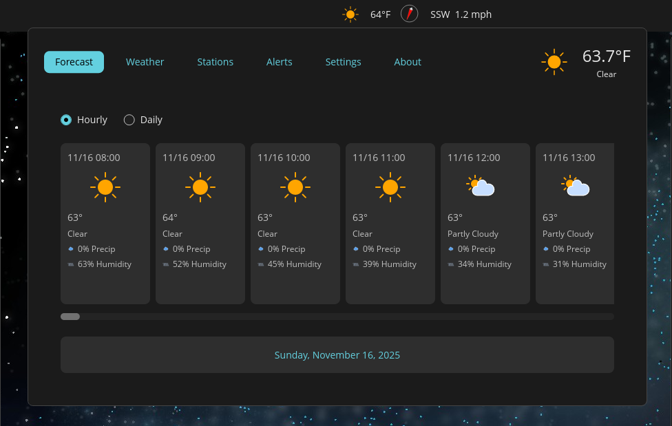
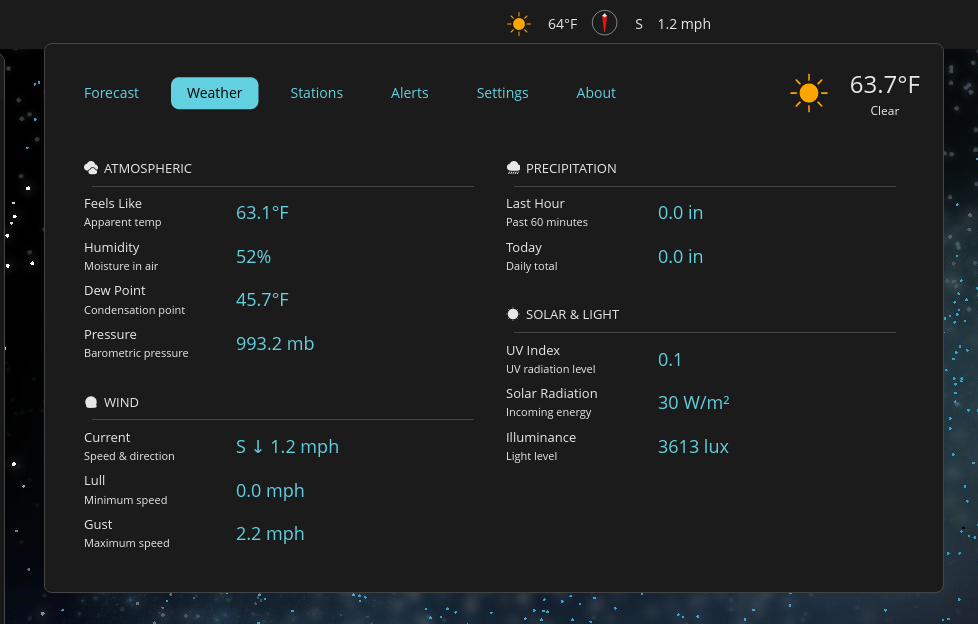

# Astra Weather Applet
Real-time weather applet for COSMIC Desktop with WebSocket updates, lightning alerts, and forecasts.





**Requires:** [WeatherFlow Tempest](https://weatherflow.com/tempest-weather-system/) weather station + API key from [tempestwx.com/settings/tokens](https://tempestwx.com/settings/tokens)

## Features

- WebSocket updates (2-3s), Lightning/Rain/Wind alerts, 7-day hourly + 10-day daily forecasts
- Multi-station support, 5 languages, 6 unit systems, secure keyring storage
- Panel integration: ~0.01 CPU, 11.8 MB RAM

## Installation

```bash
# System dependencies (Pop!_OS/Ubuntu/Debian)
# libdbus-1-dev: Secret Service keyring | pkg-config: build tool | libssl-dev: TLS
sudo apt install libdbus-1-dev pkg-config libssl-dev

# Build and install
git clone https://github.com/JasonBrannon/astra-weather-applet
cd astra-weather-applet
just        # Builds release (uses build-release target)
just install

# Add to panel: Settings → Desktop → Panel → Configure panel applets → Add "Astra Weather"
# Setup: Get API key from tempestwx.com/settings/tokens → Enter in Settings tab → Select station
```

See **[CONTRIBUTING.md](CONTRIBUTING.md)** for bug reports, PRs, translations, and code standards.

## Development

```bash
just build-release                                          # Release build
cargo run -- --test                                         # Test without GUI
RUST_LOG=debug cargo run                                    # Debug logging
just install / just uninstall / just uninstall-all         # Install management

# Code quality (zero warnings policy)
cargo build --release 2>&1 | grep "^warning:" | wc -l     # Must be 0
just check-headers                                          # GPL-3.0 headers
just sbom                                                   # Generate SBOM
```

**Architecture:** Handler-based (51 handlers, 9 modules), dual connection status (REST + WebSocket), `OnceLock` icon caching (240 cards), typestate pattern

**Config:** `~/.config/cosmic/com.slagmine.astra/` (units, station ID, notifications, language, API key via keyring)

## Packaging

```bash
# Distribution packages (vendor dependencies)
just vendor && just build-vendored
just rootdir=debian/astra prefix=/usr install

# Flatpak (see FLATPAK.md for details)
just flatpak-sources                                # Generate cargo-sources.json
flatpak-builder build-dir com.slagmine.astra.json  # Build
```

**Privacy:** No telemetry, analytics, or third-party services. Direct WeatherFlow API only. Local storage. Keyring-encrypted API keys.
**Security:** [SECURITY.md](SECURITY.md) | **SBOM:** [SBOM.md](SBOM.md) (721 deps)

## License & Credits

**[GPL-3.0-or-later](LICENSE.md)** | Built with [Rust](https://www.rust-lang.org/), [libcosmic](https://github.com/pop-os/libcosmic), [WeatherFlow API](https://weatherflow.github.io/Tempest/api/)

Developed on [System76 Thelio Major R3](https://tech-docs.system76.com/models/thelio-major-r3/README.html) (Pop!_OS 24.04 LTS, COSMIC Desktop)

---

**Links:** [Contributing](CONTRIBUTING.md) | [Features](FEATURES.md) | [Security](SECURITY.md) | [Flatpak](FLATPAK.md) | [Issues](https://github.com/JasonBrannon/astra-weather-applet/issues)


**Made for the COSMIC Desktop community with ❤️** | GPL-3.0-or-later
